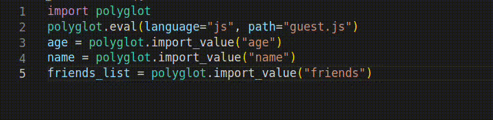
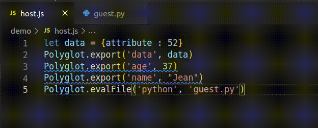
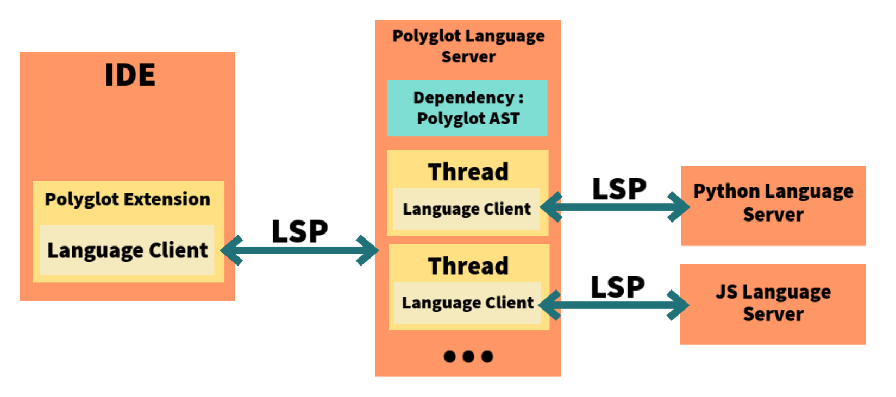

# :bookmark_tabs: Polyglot Language Server:
[GraalVM](https://www.graalvm.org/) is a JDK that brings Polyglot capability which allows *"multiple programming languages in a single application while eliminating foreign language call costs"*.

The drawback of developing such applications is that there are no tools for developers to debug or diagnose their polyglot programs.

Polyglot Language Server is a prototype that provides diagnostics, type checking & auto-completion for Polyglot's GraalVM programs.
For now, Polyglot Language Server supports only Python & Javascript.
# :hammer: How to install :
It is highly recommended to run on linux.
All these steps have been tested on an ubuntu docker container (look at Dockerfile for details).
### 0 - Prerequisites :
Install packages :
```bash
sudo apt-get install python3                        #PYTHON3
sudo apt-get install nodejs                         #NODEJS
sudo apt install openjdk-11-jre-headless            #JDK11
sudo apt install git                                #GIT
sudo apt-get install build-essential                #BUILD ESSENTIAL
sudo apt install maven                              #MAVEN
sudo apt-get install build-essential cmake          #CMAKE
sudo apt install clang-14 --install-suggests        #CLANG
sudo apt install default-jdk                        #DEFAULT JDK
sudo apt install node-typescript                    #NODE TYPESCRIPT
sudo apt-get install npm                            # NPM
sudo apt-get install python3-pip                    # PIP
```

Add links to clang :
```bash
sudo ln -s /usr/bin/clang-14 /usr/bin/clang
sudo ln -s /usr/bin/clang++-14 /usr/bin/clang++
```

Export java home variable :
```bash
sudo export JAVA_HOME=/usr/lib/jvm/java-11-openjdk-amd64
```

Create an empty directory and cd in it. Clone all these repositories in this folder :

```bash
git clone https://github.com/quentinLeDilavrec/jsitter
git clone https://github.com/yami2200/tree-sitter
git clone https://github.com/tree-sitter/tree-sitter-python
git clone https://github.com/tree-sitter/tree-sitter-javascript
git clone --recurse-submodules https://github.com/yami2200/polyglot-language-server
git clone https://github.com/tree-sitter/tree-sitter-go
git clone https://github.com/tree-sitter/tree-sitter-java
git clone https://github.com/yami2200/PolyglotAST
```

### 1 - Polyglot AST :

From the folder created previously, runs these commands :
```bash
cd ./PolyglotAST
sudo ./install.sh
```

### 2 - Polyglot Language Server : 
Go to the folder polyglot-language-server/ and run :
```bash
./install.sh
```

If the tests run successfully, you're good to start testing it with the vscode client.

### 3 - Polyglot Language Client (vscode) :

Go to the folder polyglot-language-server/vscode-client/ and run :
```bash
npm install
npm run compile
```

Open vscode and open the folder polyglot-language-server/vscode-client/ in vscode.
Open src/core/extension.ts, press F5, and click on "VS Code Extension Development".
This will run a new Vscode Window with the extension running.


You can open the folder examples/ where you will find some polyglot programs made to show diagnostics or specially made to test type checking.


When testing the language server, you can go to the output tab and select the "Polyglot" channel to see what is happening in logs.

# :closed_book: Features :

## Diagnostics : 

### Description  :
Diagnostics are information, warning or error messages represented with an underline effect.


### Diagnostics handled :

| Diagnostic                | Description                                                                       | Type    |
|---------------------------|-----------------------------------------------------------------------------------|---------|
| Evaluation File not found | Occurs if you wrote a polyglot evaluation of a file that doesn't exist            | Error   |
| Unused Export             | Occurs if you exported a variable but never imported it back.                     | Info    |
| Import Before Export      | Occurs if you import a variable that is exported after the import statement       | Warning |
| Import without Export     | Occurs if you import a variable that has never been exported in a polyglot context | Warning |
| Useless Variable Import   | Occurs if you import a variable that was exported previously from the same file   | Info    |
| Same File Evaluation      | Occurs if you write a polyglot evaluation of the file you are currently in        | Warning |

### How it works :

After a change, the language server makes a linear visit of the polyglot AST and isolate some inconsistencies with the import and export statements.

## Type Checking :
### Description  :
Type Checking gives you the possibility to get the type of variable that was imported from a polyglot context.



### How it works :


## Auto-Completion :

### Description :

Auto Completion is a little prototype feature that gives you the possibility to import any variable from the polyglot context that is still not imported in the current file.



### How it works :

* 1 - Gather all variables that have been exported from all files part of the polyglot program into a list.
* 2 - Remove from the list all variables that are imported in the current file.
* 3 - Add completion item for each variable from the list, with the proper code depending on the current file programming language.

# Structure :

The polyglot language server is designed to work with other specific language servers. It makes requests to python & javascript language server, to avoid to have to develop parsing & analysis algorithms for each language we implement in the Polyglot Language Server.
This structure allows using results from request to these specific language servers to show polyglot results. The type checking system uses this feature to get the type of variable in a specific language.

