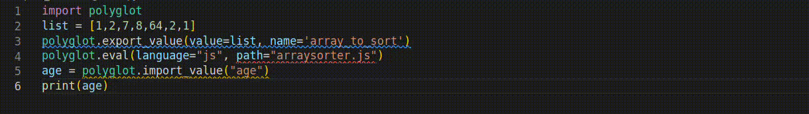

# :bookmark_tabs: Polyglot Language Server:
[GraalVM](https://www.graalvm.org/) is a JDK that brings Polyglot capability which allows *"multiple programming languages in a single application while eliminating foreign language call costs"*.

The drawback of developing such applications is that there are no tools for developers to debug or diagnose their polyglot program.

Polyglot Language Server is a prototype which provides diagnostics, type checking & auto-completion for Polyglot's GraalVM programs.

# :hammer: How to install :
It is highly recommend to run on linux.
All these steps have been tested on an ubuntu docker container (look at Dockerfile for details).
### 0 - Prerequisites :
Install packages :
```bash
sudo apt-get install python3                        #PYTHON3
sudo apt-get install nodejs                         #NODEJS
sudo apt install openjdk-11-jre-headless            #JDK11
sudo apt install git                                #GIT
sudo apt-get install build-essential                #BUILD ESSENTIAL
sudo apt install maven                              #MAVEN
sudo apt-get install build-essential cmake          #CMAKE
sudo apt install clang-14 --install-suggests        #CLANG
sudo apt install default-jdk                        #DEFAULT JDK
sudo apt install node-typescript                    #NODE TYPESCRIPT
```

Add links to clang :
```bash
sudo ln -s /usr/bin/clang-14 /usr/bin/clang
sudo ln -s /usr/bin/clang++-14 /usr/bin/clang++
```

Export java home variable :
```bash
sudo export JAVA_HOME=/usr/lib/jvm/java-11-openjdk-amd64
```

Create an empty directory and cd in it. Clone all these repositories in this folder :

```bash
git clone https://github.com/quentinLeDilavrec/jsitter
git clone https://github.com/yami2200/tree-sitter
git clone https://github.com/tree-sitter/tree-sitter-python
git clone https://github.com/tree-sitter/tree-sitter-javascript
git clone --recurse-submodules https://github.com/yami2200/polyglot-language-server
git clone https://github.com/tree-sitter/tree-sitter-go
git clone https://github.com/tree-sitter/tree-sitter-java
git clone https://github.com/yami2200/PolyglotAST
```

### 1 - Polyglot AST :

From the folder created previously, runs these commands :
```bash
cd ./PolyglotAST
sudo ./install.sh
```

### 2 - Polyglot Language Server : 


### 3 - Polyglot Language Client (vscode) :

Go to the folder polyglot-language-server/vscode-client/ and run :
```bash
npm install
npm run compile
```

Open vscode and open the folder polyglot-language-server/vscode-client/ in vscode.
Open src/core/extension.ts, press F5, and click on "VS Code Extension Development".
This will run a new Vscode Window with the extension running.

# :closed_book: Features :

## Diagnostics : 

### Description  :
Diagnostics are information, warning or error messages represented with an underline effect.



### Diagnostics handled :

| Diagnostic                | Description                                                                        | Type    |
|---------------------------|------------------------------------------------------------------------------------|---------|
| Evaluation File not found | Occurs if you wrote an polyglot evaluation of a file that doesn't exist            | Error   |
| Unused Export             | Occurs if you exported a variable but never imported it back.                      | Info    |
| Import Before Export      | Occurs if you import a variable that is exported after the import statement        | Warning |
| Import without Export     | Occurs if you import a variable that has never been exported in a polyglot context | Warning |
| Useless Variable Import   | Occurs if you import a variable that was exported previously from the same file    | Info    |
| Same File Evaluation      | Occurs if you write a polyglot evaluation of the file you are currently in         | Warning |

### How it works :

After a change, the language server make a linear visit of the polyglot AST and isolate some inconsistencies with the import and export statements.

## Type Checking :
### Description  :
Type Checking gives you the possibility to get the type of variable that was imported from polyglot context.


### How it works :


## Auto-Completion :

### Description :

Auto Completion is a little prototype feature which gives you the possibility to import any variable from the polyglot context that are still not imported in the current file.


### How it works :

* 1 - Gather all variables that have been exported from all files part of the polyglot program into a list.
* 2 - Remove from the list all variables that are imported in the current file.
* 3 - Add completion item for each variable from the list, with the proper code depending on the current file programming language.